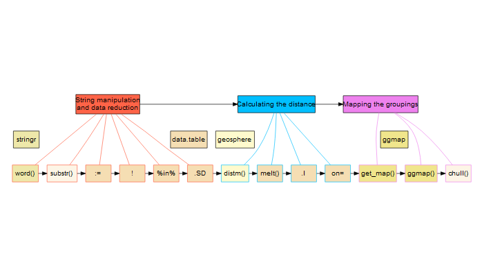

# Task

## Objective

To take a table of all the postcodes in the UK, and work out which of 31 weather stations is the closest to supply weather data to them

```{r setup, include=FALSE}
library(knitr)
read_chunk('postcodeStrings.R')
read_chunk('postcodeMatching.R')
read_chunk('mappingSectors.R')
read_chunk('workflow.R')
knitr::opts_chunk$set(warning = FALSE)
```

## Workflow Breakdown


# String manipulation and data reduction

## Objective

To take lat-lon data for every postcode in the UK and create an average lat-lon value for the postcodes per sector

<small> lat-lon stands for 'Latitude' and 'Longitude', which refer to the 2 dimensional co-ordinate system for mapping a location on the surface of the earth.</small>

## Some libs and data

* `data.table` makes data objects with SQLish behaviors
* `stringr` handles string manipulation tasks

```{r postcodeStrings_Libs}
```

## Some data

* `stringr::word()` separates the postcodes on the space, returning each part, with no leading or trailing space
* `substr()` takes the first character of `inward` and attaches it to the end of `outward` to make the 'sector' level

```{r postcodeStrings_Word}
```

<small> `:=` assigns a new column in the `data.table`</small>

## Some munging
<small>Some sectors are known to not be 'geographical' and are effectively proxies, so they should be removed</small>

* `!` is equivalent to 'NOT'
* `%in%` is a keyword for data.tables which searches for every instance of the criteria in the relevant column


```{r nonGeo_filter}
```

## Sector 'Average' location
```{r postcodeStrings_AvLL}
```

<small> Using the average location of each sector is a data reduction reduction exercise. Decreasing `r ukpostcodesSub[, .N]` records to only `r sectorPostcodes[, .N]`. It would be computationally more challenging to operate on the original data set length.</small>

# Calculating the distance

## Objective

To calculate the distance between each postcode sector and each weather station and identify which weather station is the closest to each sector

## Some more libs and data

* `geosphere` contains functions to calculate distance matrices

```{r postcodeMatching_Libs, results ='asis', warning=FALSE, message=FALSE}
```

## Calculating the distance matrix

* `distm()` calculates a distance matrix from two tables with latitutde and longitude

<small> The `Vicenty Ellipse` method is the most accurate, and computationally intensive, however it can be completed in around a minute on reasonable domestic hardware.</small>

```{r postcodeMatching_DistM}
```

<small>In `postcodeDistances`, each column is a different station and each row is a different postcode</small>


## Selecting minimum distance

* `melt()` converts wide data structure to long

```{r postcodeMatching_Melt}
```

* `which.min()` returns location of minimum distance

```{r postcodeMatching_Minimum}
```

## Index by .I

* `.I` is a data.table argument which is equivalent to `seq_len(nrow(x))`.

```{r postcodeMatching_Index}
```

<small>This effectively gives us a counter for each row of `stationLocation` which directly correlates with the columns of `postcodeDistances`, and therefore also with `stationRow` in `postcodesSector`.</small>

## Join by on

<small>So we can now merge the information from `stationLocation` onto `postcodesSector` using `stationRow` as an index.</small>

* `on=` specifies key to join on

```{r postcodeMatching_Merge}
```

# Mapping the groupings

## Objective
Plot each sector on a map of the UK and identify which weather station it belongs to

## Moar libs and data

* Use `ggmap` to plot data onto maps

```{r mappingSectors_Libs}
```

## Calculating the geographical bounding box

If we know what the geographical extent of the data is...

```{r mappingSectors_boundingBox}
```

## Source map tiles

... we can use `ggmap` functions to pull map tiles from various services

```{r mappingSectors_tiles}
```

## Plot points - code

<small>`ggmap` syntax is based on "The Grammar of Graphics", just like `ggplot2`</small>

* Plot a layer with `geom_something()`
* Add layers with `+`

```{r mappingSectors_codePoints}
```

## Plot points - map

```{r mappingSectors_plotPoints, echo = FALSE}
```

## Boundary polygons

* `chull()` calculates outer boundary of each group

```{r mappingSectors_calcPoly}
```

## Plot boundary - code

* `geom_polygon()` is a layer that plots area rather than points

```{r mappingSectors_codePoly}
```

## Plot boundary - map
```{r mappingSectors_plotPoly, echo = FALSE}
```

# Conclusions

## Workflow Solution


# My Locations

Twitter: @Biomimicron

Github: DaveRGP